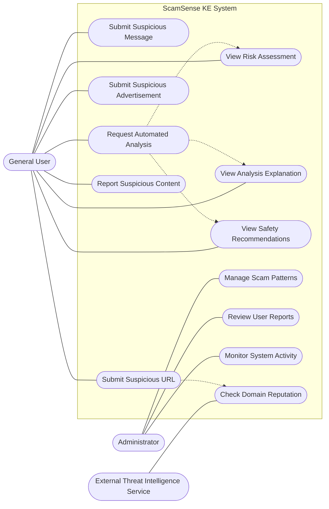

# Use Case Diagram

The use case diagram illustrates how the different actors interact with the ScamSense KE system.


```mermaid
flowchart LR
    User([General User])
    Admin([Administrator])
    Threat([External Threat Intelligence Service])

    subgraph System["ScamSense KE System"]
        UC1([Submit Suspicious Message])
        UC2([Submit Suspicious URL])
        UC3([Submit Suspicious Advertisement])
        UC4([Request Automated Analysis])
        UC5([View Risk Assessment])
        UC6([View Analysis Explanation])
        UC7([View Safety Recommendations])
        UC8([Report Suspicious Content])
        UC9([Manage Scam Patterns])
        UC10([Review User Reports])
        UC11([Monitor System Activity])
        UC12([Check Domain Reputation])
    end

    User --- UC1
    User --- UC2
    User --- UC3
    User --- UC4
    User --- UC5
    User --- UC6
    User --- UC7
    User --- UC8

    Admin --- UC9
    Admin --- UC10
    Admin --- UC11

    Threat --- UC12
    UC2 -.-> UC12
    UC4 -.-> UC5
    UC4 -.-> UC6
    UC4 -.-> UC7
```
```


